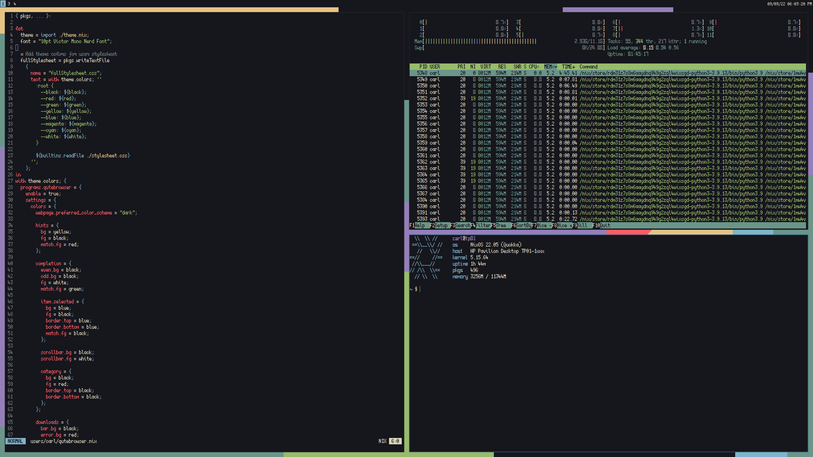
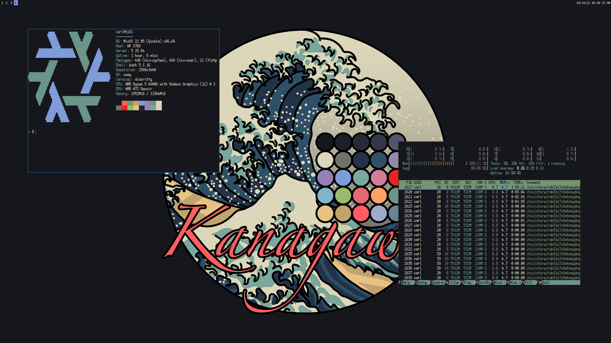

# nixos-configuration
My NixOS configuration / flake

## Screenshots

## Colorschemes

- [kanagawa](https://github.com/rebelot/kanagawa.nvim)

### Previous

- [One Dark](https://github.com/joshdick/onedark.vim)

## Fonts

- Terminal - [Scientifica](https://github.com/nerdypepper/scientifica)
- Browser - [Victor Mono](https://github.com/rubjo/victor-mono)

## Programs

- Editor - [NeoVim](https://github.com/neovim/neovim)
- Terminal - [Alacritty](https://github.com/alacritty/alacritty)
- Browser - [qutebrowser](https://github.com/qutebrowser/qutebrowser)
- Password Manager - [KeePassXC](https://github.com/keepassxreboot/keepassxc)
- Music Player - [MPV](https://github.com/mpv-player/mpv)

## Desktop
- Window Manager - [Sway](https://swaywm.org/)
- Background from [Kanagawa.nvim's GitHub](https://github.com/rebelot/kanagawa.nvim)

## Other

- Filesystem - btrfs
- Shell - zsh

## TODO

- see number of updates
- ligatures?
- gcroots
- Fix telescope
- Correct lua importing
- tmpfs
- path stuff
- vms
- dwl? Flickering
- usb iso
- tetris
- line 53 w3m??!??!?!?

